<!-- SECTIONS:API,WEBUI,DOCKER,TESTS -->

# Project Overview | vid2gif-webui

A self-hosted web application for converting video files to animated GIFs using ffmpeg. Designed for homelab users who want a simple, browser-based interface for batch video-to-GIF conversion with trimming, scaling, and FPS control.

[](https://www.python.org/)
[](https://fastapi.tiangolo.com/)
[](LICENSE)
[](#version-summary)

---

## Table of Contents

- [Quickstart for Developers](#quickstart-for-developers)
- [Version Summary](#version-summary)
- [Project Features](#project-features)
- [Project Structure](#project-structure)
- [Architecture Highlights](#architecture-highlights)
- [API Reference](#api-reference)
- [WebUI Overview](#webui-overview)
- [Docker Deployment](#docker-deployment)
- [Configuration & Environment Variables](#configuration--environment-variables)
- [Coding Standards](#coding-standards)
- [Testing](#testing)
- [Development Workflow](#development-workflow)

---

## Quickstart for Developers

```bash
# Clone the repository
git clone https://github.com/beecave-homelab/vid2gif-webui.git
cd vid2gif-webui

# Install dependencies (requires PDM)
pdm install

# Run development server (requires ffmpeg installed locally)
pdm run start-dev

# Or use Docker for development
docker compose -f docker-compose.dev.yaml up --build
```

Access the WebUI at `http://localhost:8080` (local/PDM or production Docker) or `http://localhost:8081` (development Docker).

---

## Version Summary

| Version | Date       | Type | Key Changes                                      |
|---------|------------|------|--------------------------------------------------|
| 0.3.0   | 2025-11-28 | ♻️   | Service layer refactor, CI/CD, improved testability |
| 0.2.0   | 2025-11-27 | ✨   | .env.example config, UX improvements, robustness |
| 0.1.0   | 2025-11-26 | ✨   | Initial release: video-to-GIF conversion via web |

---

## Project Features

- **Drag-and-drop video upload** — supports multiple files in a single batch
- **Video trimming** — set start/end times per video with sliders and numeric inputs
- **Configurable output** — scale (320px–4K) and FPS (1–20)
- **Real-time progress** — per-file percentage and ETA via polling
- **Concurrent conversion limiting** — semaphore-controlled ffmpeg processes
- **Automatic job cleanup** — expired jobs and temp files removed after TTL
- **Docker-ready** — production and development compose files included

---

## Project Structure

<details><summary>Show tree</summary>

```text
vid2gif-webui/
├── vid2gif/                    # Main application package
│   ├── __init__.py             # Package init
│   ├── backend/                # Python FastAPI backend
│   │   ├── app.py              # Thin HTTP layer: endpoints, routing
│   │   ├── services/           # Service layer (SRP/OCP)
│   │   │   ├── conversion.py   # Conversion orchestration
│   │   │   ├── ffmpeg_runner.py # FFmpeg subprocess execution
│   │   │   ├── file_manager.py # Filesystem I/O, cleanup
│   │   │   └── job_store.py    # Job state management
│   │   └── utils/
│   │       ├── constant.py     # Centralized configuration constants
│   │       └── env_loader.py   # Environment variable loader
│   └── frontend/               # Static HTML/CSS/JS frontend
│       ├── index.html          # Main UI page
│       ├── script.js           # Client-side logic: upload, polling, editor
│       └── style.css           # Dark-themed responsive styles
├── tests/                      # Pytest test suite
│   ├── test_backend_app_flow.py # Endpoint and job processing tests
│   ├── test_cleanup_jobs.py    # Job expiration and temp file cleanup
│   ├── test_concurrency_limit.py # Semaphore-based ffmpeg limiting
│   ├── test_scale_validation.py  # Scale allowlist validation
│   └── test_services.py        # Service layer unit tests
├── Dockerfile                  # Production container image
├── Dockerfile.dev              # Development container image
├── docker-compose.yaml         # Production compose (Gunicorn on 8080)
├── docker-compose.dev.yaml     # Development compose (Uvicorn reload on 8081)
├── .env.example                # Example environment configuration
├── pyproject.toml              # PDM project config, dependencies, scripts
├── pdm.lock                    # Locked dependency versions
├── AGENTS.md                   # Coding rules and standards (Ruff + Pytest + SOLID)
└── README.md                   # Brief project description
```

</details>

---

## Architecture Highlights

### Backend (`vid2gif/backend/`)

- **Framework**: FastAPI with Uvicorn (dev) / Gunicorn (prod)
- **Service Layer**: Modular architecture following SRP/OCP principles
  - `app.py` — Thin HTTP layer, endpoints only
  - `services/job_store.py` — Thread-safe job state management
  - `services/ffmpeg_runner.py` — FFmpeg subprocess execution & progress parsing
  - `services/file_manager.py` — Filesystem I/O, temp dirs, cleanup
  - `services/conversion.py` — Orchestration coordinator
- **Concurrency Control**: `threading.Semaphore` limits simultaneous ffmpeg processes (default: 4)
- **Dependency Injection**: Services are injected, enabling easy testing and mocking
- **Cleanup**: Expired jobs removed opportunistically on each `/convert` request

### Frontend (`vid2gif/frontend/`)

- **Vanilla JS** — no build step required
- **Video Editor**: Per-file start/end sliders synced with `<video>` element
- **Polling**: `pollProgress()` fetches `/progress?job_id=...` every second until done
- **Dark Theme**: Minimal CSS with responsive layout

### Data Flow

```mermaid
stateDiagram-v2
direction LR

[*] --> Client_Idle

%% Client states
Client_Idle: Client idle
Client_Upload: Select files + configure trim/scale/fps
Client_Wait: Waiting for progress
Client_Ready: Ready to download GIF(s)
Client_Done: Conversion completed

%% Backend states
Backend_Idle: No active conversion job
Backend_Validate: Validate request & normalize params
Backend_Job: Create job_id & job record
Backend_Run: Track job progress (ffmpeg stderr)
Backend_Done: Mark job done (populate downloads[].url)
Backend_Error: Mark job failed
Backend_Cleanup: Cleanup expired jobs (TTL)

%% Worker states
Worker_Start: Start ffmpeg process
Worker_Run: ffmpeg encodes GIF(s)
Worker_Ok: Exit 0 (success)
Worker_Fail: Exit != 0 (error)

%% Core client flow
Client_Idle --> Client_Upload: select files + options
Client_Upload --> Backend_Validate: POST /convert
Client_Upload --> Client_Wait: waiting for first progress
Client_Wait --> Backend_Run: GET /progress?job_id=...
Backend_Run --> Client_Wait: status + percent + ETA
Backend_Run --> Backend_Done: status == done
Backend_Done --> Client_Ready
Client_Ready --> Client_Done: GET /download/{job_id}/{gif}
Client_Done --> Client_Idle
Client_Done --> [*]

%% Backend validation & lifecycle
Backend_Idle --> Backend_Validate: receive /convert
Backend_Validate --> Backend_Job: valid
Backend_Validate --> Backend_Error: invalid
Backend_Job --> Backend_Run: start tracking job

%% Worker execution
Backend_Job --> Worker_Start: spawn ffmpeg
Worker_Start --> Worker_Run
Worker_Run --> Worker_Ok: exit 0
Worker_Run --> Worker_Fail: exit != 0
Worker_Ok --> Backend_Done
Worker_Fail --> Backend_Error

%% Cleanup
Backend_Done --> Backend_Cleanup
Backend_Error --> Backend_Cleanup
Backend_Cleanup --> Backend_Idle

%% Styling (at least three distinct colors)
classDef client fill:#7c3aed,stroke:#4c1d95,color:#f9fafb
classDef backend fill:#2563eb,stroke:#1e3a8a,color:#f9fafb
classDef worker fill:#9ca3af,stroke:#4b5563,color:#111827
classDef waiting fill:#f97316,stroke:#c2410c,color:#111827
classDef success fill:#16a34a,stroke:#166534,color:#f9fafb
classDef error fill:#dc2626,stroke:#991b1b,color:#f9fafb

class Client_Idle,Client_Upload,Client_Wait,Client_Ready,Client_Done client
class Backend_Idle,Backend_Validate,Backend_Job,Backend_Run,Backend_Done,Backend_Error,Backend_Cleanup backend
class Worker_Start,Worker_Run,Worker_Ok,Worker_Fail worker

class Client_Wait waiting
class Client_Done,Backend_Done,Worker_Ok success
class Backend_Error,Worker_Fail error
```



---

## API Reference

### `POST /convert`

Start a batch conversion job.

| Parameter     | Type           | Description                                      |
|---------------|----------------|--------------------------------------------------|
| `files`       | `UploadFile[]` | Video files to convert                           |
| `scale`       | `str`          | Output width (`original`, `320:-1`, ..., `3840:-1`) |
| `fps`         | `int`          | Frames per second (1–20, default 10)             |
| `start_times` | `str[]`        | Start time in seconds per file                   |
| `end_times`   | `str[]`        | End time in seconds per file                     |

**Response**: `{ "job_id": "<uuid>" }`

**Constraints and notes:**

- The lengths of `files`, `start_times`, and `end_times` **must match**.
- `start_times` and `end_times` are **seconds as strings** (floats allowed per file).
- For each file: `0 <= start_times[i] < end_times[i]`.
- `fps` must be between **1 and 20** (inclusive).
- `scale` must be one of:
  - `original`, `320:-1`, `360:-1`, `480:-1`, `720:-1`,
    `1080:-1`, `1920:-1`, `2560:-1`, `3840:-1`.

### Example: API usage with curl

The following examples assume the API is reachable at `http://localhost:8080`.
Adjust the port as needed (for example, `8081` when using `docker-compose.dev.yaml`,
or `8000` if you run Uvicorn directly).

#### 1. Start a conversion job

Single file, keep original size, first 10 seconds at 10 FPS:

```bash
curl -X POST "http://localhost:8080/convert" \
  -F "files=@/absolute/path/to/video.mov" \
  -F "scale=original" \
  -F "fps=10" \
  -F "start_times=0" \
  -F "end_times=10"
```

For multiple files, repeat the form fields; all lists must have the same length:

```bash
curl -X POST "http://localhost:8080/convert" \
  -F "files=@/path/to/clip1.mov" \
  -F "files=@/path/to/clip2.mov" \
  -F "scale=720:-1" \
  -F "fps=12" \
  -F "start_times=0" \
  -F "start_times=5" \
  -F "end_times=8" \
  -F "end_times=15"
```

The response will contain a job identifier:

```json
{ "job_id": "<uuid>" }
```

### `GET /progress`

Poll job status.

| Parameter | Type  | Description         |
|-----------|-------|---------------------|
| `job_id`  | `str` | UUID from `/convert`|

**Response** (example):

```json
{
  "total_files": 2,
  "processed_files": 1,
  "successful_files": 1,
  "error_files": 0,
  "status": "Converting file 2/2 (video.mp4)...",
  "current_file_percent": 45.2,
  "current_file_est_seconds": 12,
  "downloads": [
    { "original": "clip.mp4", "url": "/download/<job_id>/clip.gif" }
  ]
}
```

### `GET /download/{job_id}/{gif_filename}`

Download a generated GIF. Returns `image/gif` with `Content-Disposition` header.

#### 2. Check job progress

Use the `job_id` from the `/convert` response:

```bash
curl "http://localhost:8080/progress?job_id=<uuid>"
```

Poll periodically (for example, every second) until `status` is `"done"` or a
final status (such as `"completed with errors"` or `"failed"`) is reported.

#### 3. Download generated GIFs

When the job is complete, use the `downloads[].url` values from the
`/progress` response. Each entry looks like:

```json
{
  "original": "clip.mp4",
  "url": "/download/<job_id>/clip.gif"
}
```

To download that file with `curl`, prepend your base URL to the `url` field:

```bash
curl -o clip.gif "http://localhost:8080/download/<job_id>/clip.gif"
```

General pattern:

```bash
curl -o <local-name>.gif "http://<host>:<port><downloads[n].url>"
```

---

## WebUI Overview

| Element            | Description                                                  |
|--------------------|--------------------------------------------------------------|
| **Drop Zone**      | Drag-and-drop or click to select video files                 |
| **Video Previews** | Inline `<video>` with playback controls                      |
| **Trim Controls**  | Start/End sliders + numeric inputs per video                 |
| **Scale Dropdown** | Preset widths from Original to 4K                            |
| **FPS Input**      | Number input (1–20)                                          |
| **Progress Bar**   | Shows overall job status and ETA                             |
| **Download Links** | Appear after conversion completes                            |

---

## Docker Deployment

### Production

```bash
docker compose up -d --build
```

- Exposes port **8080**
- Uses `Dockerfile` and the image's default command (Gunicorn binding to port 8080)
- Does **not** mount source code as volumes by default (suitable for more production-like runs)

### Development

```bash
docker compose -f docker-compose.dev.yaml up --build
```

- Exposes port **8081**
- Uses `Dockerfile.dev` with Uvicorn `--reload` and `--log-level debug`
- Mounts `./vid2gif` into the container for live code editing

### Image Details

- **Base**: `python:3.10-slim`
- **System deps**: `ffmpeg`, `gcc`
- **Python deps**: Installed from PDM-generated requirements files (`requirements.txt`, `requirements.dev.txt`)

---

## Configuration & Environment Variables

All configuration is centralized in `vid2gif/backend/utils/constant.py`. **Do not** read `os.environ` elsewhere.

The canonical list of runtime variables and their defaults lives in `.env.example`:

| Variable              | Default | Description                                |
|-----------------------|---------|--------------------------------------------|
| `TMP_BASE_DIR`        | `tmp`   | Directory for temporary job files          |
| `JOB_TTL_SECONDS`     | `3600`  | Seconds before expired jobs are cleaned up |
| `FFMPEG_MAX_CONCURRENT` | `4`   | Max simultaneous ffmpeg processes          |

Recommended workflow:

1. Copy `.env.example` to `.env` and adjust values for your environment.
2. Ensure these variables are visible in the process environment when starting the app:
   - For local runs (`pdm run start-dev` or `pdm run start-prod`), export them via your shell, a `.env` loader, or your process manager.
   - For Docker/Compose, wire them in via `env_file: .env` or explicit `environment:` keys in your own compose overrides.

---

## Coding Standards

This project follows strict coding rules defined in [`AGENTS.md`](AGENTS.md). Key points:

### Linting & Formatting

- **Ruff** is the single source of truth
- Rules enabled: `F`, `E`, `W`, `N`, `I`, `D`, `DOC`, `TID`, `UP`, `FA`
- Line length: 100 characters
- Docstring style: Google

```bash
pdm run lint      # Check
pdm run fix       # Auto-fix
pdm run format    # Format
```

### Naming Conventions

- **Functions/variables**: `snake_case`
- **Classes**: `PascalCase`
- **Constants**: `UPPER_CASE`

### Imports

1. Standard library
2. Third-party
3. First-party/local

Always use `from __future__ import annotations` at the top of Python files.

### SOLID Principles

- **SRP**: One responsibility per module/function
- **OCP**: Extend via protocols, not modification
- **LSP**: Subtypes must be substitutable
- **ISP**: Small, role-specific interfaces
- **DIP**: Depend on abstractions, inject dependencies

### Configuration Management

- Environment variables loaded **once** in `env_loader.py`
- Constants exposed **only** from `constant.py`
- No direct `os.environ` access outside `constant.py`

---

## Testing

### Running Tests

```bash
# Quick run
pdm run test

# With coverage
pdm run test-cov
```

### Test Files

| File                          | Coverage Area                               |
|-------------------------------|---------------------------------------------|
| `test_backend_app_flow.py`    | Endpoint and job processing tests           |
| `test_cleanup_jobs.py`        | Job expiration and temp directory cleanup   |
| `test_concurrency_limit.py`   | Semaphore-based ffmpeg concurrency control  |
| `test_scale_validation.py`    | `is_scale_allowed()` allowlist validation   |
| `test_services.py`            | Service layer unit tests                    |

### Test Naming Convention

```text
test_<unit_under_test>__<expected_behavior>()
```

### Coverage Target

Guideline: **≥ 85%** line coverage. CI should fail below threshold.

---

## Development Workflow

### 1. Setup

```bash
pdm install
```

### 2. Run Dev Server

```bash
pdm run start-dev
# or
docker compose -f docker-compose.dev.yaml up --build
```

### 3. Make Changes

- Backend: Edit files in `vid2gif/backend/` (hot-reload enabled)
- Frontend: Edit `vid2gif/frontend/*.{html,js,css}` (refresh browser)

### 4. Lint & Format

```bash
pdm run fix
pdm run format
```

### 5. Test

```bash
pdm run test
pdm run test-cov
```

### 6. Commit

Run lint + tests before committing. Use conventional commit format.

---

## Key Files Reference

| File                                    | Purpose                                         |
|-----------------------------------------|-------------------------------------------------|
| `vid2gif/backend/app.py`                | FastAPI endpoints (thin HTTP layer)             |
| `vid2gif/backend/services/conversion.py`| Conversion orchestration                        |
| `vid2gif/backend/services/job_store.py` | Job state management                            |
| `vid2gif/backend/services/ffmpeg_runner.py` | FFmpeg execution & progress parsing         |
| `vid2gif/backend/services/file_manager.py`  | Filesystem I/O & cleanup                    |
| `vid2gif/backend/utils/constant.py`     | Centralized configuration constants             |
| `vid2gif/frontend/index.html`           | Main HTML structure                             |
| `vid2gif/frontend/script.js`            | Client-side upload, polling, video editor       |
| `vid2gif/frontend/style.css`            | Dark-themed responsive styles                   |
| `pyproject.toml`                        | Project metadata, dependencies, PDM scripts     |
| `AGENTS.md`                             | Coding rules (Ruff, Pytest, SOLID)              |
| `Dockerfile`                            | Production container build                      |
| `docker-compose.yaml`                   | Production deployment                           |

---

## Dependencies

### Runtime (Python)

| Package            | Version   | Purpose                          |
|--------------------|-----------|----------------------------------|
| `fastapi`          | ≥0.122.0  | Web framework                    |
| `uvicorn[standard]`| ≥0.38.0   | ASGI server (dev)                |
| `gunicorn`         | ≥23.0.0   | WSGI server (prod)               |
| `python-multipart` | ≥0.0.20   | File upload handling             |
| `python-env`       | ≥1.0.0    | Environment utilities            |

### Development (Python)

| Package      | Version  | Purpose                |
|--------------|----------|------------------------|
| `ruff`       | ≥0.6.9   | Linting & formatting   |
| `pytest`     | ≥8.0.0   | Testing framework      |
| `pytest-cov` | ≥5.0.0   | Coverage reporting     |

### System

| Tool     | Purpose                        |
|----------|--------------------------------|
| `ffmpeg` | Video-to-GIF conversion engine |

### Managing dependency changes

When you add or update Python dependencies, follow this workflow so that both `pyproject.toml` and the exported requirements files stay in sync:

1. **Add a new dependency** (updates `pyproject.toml` and lock file):

   ```bash
   pdm add <package>
   pdm lock
   pdm install
   ```

2. **Regenerate requirements files** (for Docker images, etc.):

   ```bash
   pdm export --pyproject --no-hashes --prod -o requirements.txt
   ```

   ```bash
   pdm export --pyproject --no-hashes --dev -o requirements.dev.txt
   ```

---

## Troubleshooting

### ffmpeg not found

Ensure ffmpeg is installed and in PATH:

```bash
# macOS
brew install ffmpeg

# Ubuntu/Debian
apt-get install ffmpeg

# Docker handles this automatically
```

### Port already in use

```bash
# Find process using port 8080
lsof -i :8080

# Kill it or use a different port
pdm run uvicorn vid2gif.backend.app:app --port 8082
```

### Job files not cleaning up

Check `JOB_TTL_SECONDS` value. Cleanup runs opportunistically on `/convert` requests.

---

**Always update this file when code or configuration changes.**
